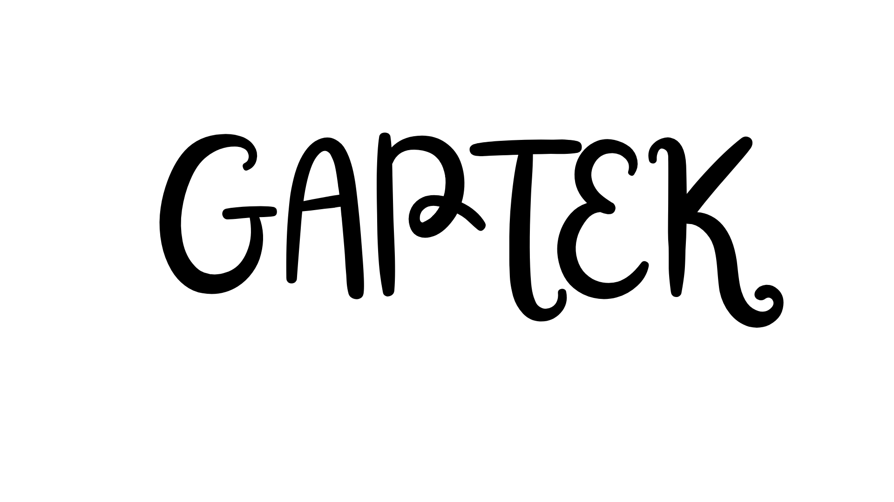

  

# Gaptek (gak usah pusing tinggal pakai)

  
  
  
  
  
  
  
  

`GAPTEK` adalah sistem manajemen ritel yang dirancang untuk menyederhanakan operasional toko, khususnya pada sektor produk teknologi seperti komputer,
perangkat genggam, dan komponen elektronik.

Seluruh kompleksitas bisnis—mulai dari perhitungan pajak, pengelolaan stok, audit transaksi, hingga pencatatan keuangan—diproses secara otomatis di bagian belakang sistem. Pengguna akhir hanya perlu mengoperasikan antarmuka yang telah disederhanakan

## Lisensi

DAK © 2026 semua hak dilindungi undang-undang

---

by : Team Digital Amore Kriyanesia 

