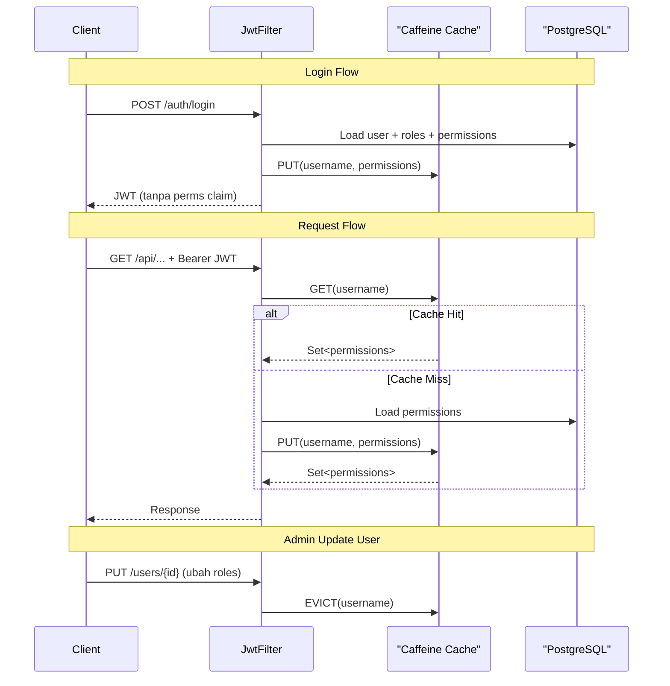

# Server-Side Permission Caching — Caffeine

## Ringkasan

JWT Access Token sekarang **tidak lagi membawa claim `perms`** — list permissions dipindahkan ke **Caffeine in-process cache** di server. Ini secara drastis mengecilkan ukuran token dan mengurangi overhead parsing.

## Arsitektur



## File yang Diubah/Ditambah

### File Baru

| File | Deskripsi |
|------|-----------|
| [CacheConfig.java](file:///c:/Projek/PKL/spravel/src/main/java/com/dak/spravel/config/CacheConfig.java) | Bean Caffeine `Cache<String, Set<String>>` dengan TTL = access token expiration |
| [PermissionCacheService.java](file:///c:/Projek/PKL/spravel/src/main/java/com/dak/spravel/service/PermissionCacheService.java) | Cache-aside service: `getPermissions`, `putPermissions`, `evict`, `evictAll` |

### File yang Dimodifikasi

| File | Perubahan |
|------|-----------|
| [pom.xml](file:///c:/Projek/PKL/spravel/pom.xml) | Tambah dependency `com.github.ben-manes.caffeine:caffeine` |
| [JwtUtil.java](file:///c:/Projek/PKL/spravel/src/main/java/com/dak/spravel/util/JwtUtil.java) | Hapus `perms` claim dari access token, hapus `getPermissionsFromToken()` |
| [JwtAuthFilter.java](file:///c:/Projek/PKL/spravel/src/main/java/com/dak/spravel/middleware/JwtAuthFilter.java) | Resolve permissions dari `PermissionCacheService` bukan dari JWT claims |
| [SecurityConfig.java](file:///c:/Projek/PKL/spravel/src/main/java/com/dak/spravel/config/SecurityConfig.java) | Inject `PermissionCacheService` ke filter |
| [AuthController.java](file:///c:/Projek/PKL/spravel/src/main/java/com/dak/spravel/controller/AuthController.java) | Warm cache on login/refresh, evict on logout/force-logout |
| [UserService.java](file:///c:/Projek/PKL/spravel/src/main/java/com/dak/spravel/service/UserService.java) | Evict cache saat admin update user roles atau delete user |
| [RoleService.java](file:///c:/Projek/PKL/spravel/src/main/java/com/dak/spravel/service/RoleService.java) | Evict ALL saat role permissions berubah atau role dihapus |

## Kapan Cache Di-Invalidate?

| Event | Aksi Cache | Scope |
|-------|-----------|-------|
| Login | `putPermissions(username, perms)` | Warm 1 user |
| Refresh Token | `putPermissions(username, perms)` — reload dari DB | Update 1 user |
| Logout | `evict(username)` | Hapus 1 user |
| Force Logout All | `evict(username)` | Hapus 1 user |
| Admin update user roles | `evict(username)` | Hapus 1 user |
| Admin delete user | `evict(username)` | Hapus 1 user |
| Admin ubah permission role | `evictAll()` | Hapus semua |
| Admin hapus role | `evictAll()` | Hapus semua |
| TTL expired (otomatis) | Auto-evict | Per entry |

## Konfigurasi Cache

```java
Caffeine.newBuilder()
    .expireAfterWrite(accessTokenExpirationMs, MILLISECONDS)  // = 5 menit
    .maximumSize(10_000)    // max 10K users cached
    .recordStats()          // expose hit/miss metrics
    .build();
```

> [!NOTE]
> TTL cache = TTL access token (5 menit). Jadi cache entry otomatis expired bersamaan dengan access token, menjaga konsistensi.

## Build Status

✅ `mvnw compile -Pskip-frontend` — **BUILD SUCCESS**
